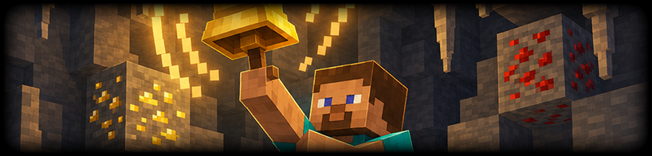

<p align="center">
  
</p>
<h1 align="center">Cobbleworks - Power Mining Plugin</h1>
<p align="center">
  <b>Expand survival mining with mounted excavation and a focused collection of utility equipment.</b><br>
  <b>Scan for ore, collect drops, track structures, escape caves, see underground, and smelt while mining.</b>
</p>
<p align="center">
  <a href="https://github.com/Cobbleworks/Power-Mining-Plugin/releases"></a>&nbsp;&nbsp;<a href="https://github.com/Cobbleworks/Power-Mining-Plugin/blob/main/LICENSE"></a>&nbsp;&nbsp;&nbsp;&nbsp;&nbsp;&nbsp;&nbsp;&nbsp;&nbsp;&nbsp;<a href="https://github.com/Cobbleworks/Power-Mining-Plugin/issues"></a>
</p>

Power Mining is an open-source Minecraft plugin that provides a set of mining utility items and mounted mining mechanics. Items are given through `/powermining` subcommands and carry per-item metadata (radius, filter, duration, mode) using persistent data. The plugin includes automated mounted mining, magnetic item collection hoppers, ore and spawner detection, wearables for underground visibility, return-point teleport ropes, structure-tracking compasses, and an auto-smelting pickaxe.

## **Core Features**

- **Mounted Mining Drill:** While riding an `AbstractHorse` and holding a pickaxe, mines a configurable cuboid ahead of the mount at a configurable interval
- **Magnet Hopper:** Custom hopper item pulls nearby dropped items toward itself on a repeating task
- **Ore Scanner Bell:** Placeable custom bell scans an area for ores and highlights found blocks for a configurable duration with a configurable cooldown
- **Miner's Helmet:** Custom golden helmet grants recurring night vision while worn
- **Escape Rope:** Custom lead sets a return point on block click and teleports back on air right-click, consuming one rope
- **Cave Compass:** Custom compass cycles structure targets and updates lodestone target to located structures
- **Smelter's Pickaxe:** Custom golden pickaxe replaces ore/block drops with smelted outputs and supports fortune-style bonus logic
- **Miner's Goggles:** Custom leather helmet highlights nearby ores with optional filter and radius metadata
- **Dungeon Locator:** Recovery compass scans loaded terrain for the nearest mob spawner, points to it, and shows the player a temporary through-wall marker

## **Supported Platforms**

- **Server Software:** `Spigot`, `Paper`, `Purpur`, `CraftBukkit`
- **Minecraft Versions:** `1.21` and higher
- **Java Requirements:** `Java 21+`
- **Dependencies:** None - fully self-contained, no external plugins required

## **Table of Contents**

1. [Core Features](#core-features)
2. [Supported Platforms](#supported-platforms)
3. [Getting Started](#getting-started)
    - [Prerequisites](#prerequisites)
    - [Installation Steps](#installation-steps)
    - [First Launch & Configuration](#first-launch--configuration)
    - [Verifying Installation](#verifying-installation)
4. [Third-Party Plugins](#third-party-plugins)
5. [Configuration](#configuration)
    - [config.yml Reference](#configyml-reference)
6. [How It Works](#how-it-works)
    - [Mounted Mining](#mounted-mining)
    - [Magnet Hopper](#magnet-hopper)
    - [Ore Scanner Bell](#ore-scanner-bell)
    - [Escape Rope](#escape-rope)
    - [Cave Compass](#cave-compass)
    - [Dungeon Locator](#dungeon-locator)
    - [Smelter's Pickaxe](#smelters-pickaxe)
    - [Miner's Goggles & Helmet](#miners-goggles--helmet)
7. [Player Commands](#player-commands)
    - [Command Reference](#command-reference)
8. [Permissions](#permissions)
9. [Building from Source](#building-from-source)
10. [License](#license)
11. [Screenshots](#screenshots)

## **Getting Started**

### **Prerequisites**

Before installing Power Mining, confirm the following requirements are met:

- A Minecraft server running **Spigot**, **Paper**, **Purpur**, or any compatible fork
- Server version **1.21 or higher** (`api-version: 1.21` is the minimum)
- **Java 21** or newer installed on the machine running the server
- Operator or console access to install plugin files

No additional plugins or libraries are needed. Power Mining has zero external dependencies.

### **Installation Steps**

1. Download the latest `PowerMining-x.x.x.jar` from the [Releases](https://github.com/Cobbleworks/Power-Mining-Plugin/releases) page
2. **Stop your server completely** before placing any files
3. Copy the `.jar` into your server's `plugins/` directory
4. Start the server - Power Mining generates its configuration folder automatically on first boot

### **First Launch & Configuration**

On the first server start after installation, Power Mining creates the following structure:

```
plugins/
└── PowerMining/
    └── config.yml   - All plugin settings with their defaults
```

All tools are available immediately after installation using `/powermining` commands. No additional configuration is required before first use. Edit `config.yml` to tune radii, intervals, ore type lists, and other per-tool settings.

### **Verifying Installation**

- Run `/plugins` in-game - `PowerMining` should appear green in the list
- Run `/version PowerMining` to confirm the installed version matches the release you downloaded
- Run `/pm helmet` to give yourself a Miner's Helmet and equip it - night vision should apply
- If the plugin fails to load, check the server console for `PowerMining` error messages (common causes: wrong Java version, corrupt JAR, or unsupported API version)

## **Third-Party Plugins**

None. Power Mining is self-contained and uses only the Bukkit server API.

## **Configuration**

### **config.yml Reference**

All settings are in `plugins/PowerMining/config.yml`.

| Key | Default | Description |
|-----|---------|-------------|
| `mounted-mining.enabled` | `true` | Enable mounted mining system |
| `mounted-mining.radius-x` | `1` | Mining radius on X-axis |
| `mounted-mining.radius-y` | `1` | Mining radius on Y-axis |
| `mounted-mining.radius-z` | `1` | Mining radius on Z-axis |
| `mounted-mining.mining-interval` | `5` | Mining interval in ticks |
| `mounted-mining.y-offset` | `1` | Y offset for mining center relative to mount |
| `magnet-hopper.enabled` | `true` | Enable magnet hopper system |
| `magnet-hopper.default-radius` | `8` | Default attraction radius for given item |
| `magnet-hopper.max-radius` | `32` | Maximum allowed radius |
| `magnet-hopper.attraction-interval` | `5` | Item attraction tick interval |
| `magnet-hopper.attraction-speed` | `0.5` | Velocity multiplier toward hopper |
| `magnet-hopper.particles.enabled` | `true` | Enable hopper particles |
| `magnet-hopper.particles.type` | `SOUL_FIRE_FLAME` | Particle type for active hoppers |
| `magnet-hopper.particles.count` | `3` | Particle count per emission |
| `magnet-hopper.particles.interval` | `10` | Particle emission interval |
| `ore-scanner-bell.enabled` | `true` | Enable ore scanner bell system |
| `ore-scanner-bell.default-radius` | `16` | Default scanner radius |
| `ore-scanner-bell.max-radius` | `64` | Maximum scanner radius |
| `ore-scanner-bell.default-duration` | `60` | Default highlight duration in ticks |
| `ore-scanner-bell.cooldown` | `30` | Cooldown in seconds per placed bell |
| `ore-scanner-bell.ore-types` | list | Materials considered ores during scan |
| `miners-helmet.enabled` | `true` | Enable miner's helmet functionality |
| `escape-rope.enabled` | `true` | Enable escape rope functionality |
| `cave-compass.enabled` | `true` | Enable cave compass functionality |
| `cave-compass.search-radius` | `5000` | Structure search radius |
| `dungeon-locator.enabled` | `true` | Enable the mob-spawner locator |
| `dungeon-locator.default-radius` | `32` | Default spherical search radius |
| `dungeon-locator.max-radius` | `48` | Maximum radius accepted by the give command |
| `dungeon-locator.cooldown-seconds` | `15` | Per-player delay between scans |
| `dungeon-locator.marker-duration-ticks` | `200` | Duration of the player-only glowing spawner marker |
| `auto-smelter-pickaxe.enabled` | `true` | Enable smelter pickaxe functionality |
| `miners-goggles.enabled` | `true` | Enable miner's goggles functionality |
| `miners-goggles.default-radius` | `10` | Default goggles radius |
| `miners-goggles.min-radius` | `5` | Minimum allowed goggles radius |
| `miners-goggles.max-radius` | `20` | Maximum allowed goggles radius |
| `miners-goggles.highlight-interval` | `20` | Highlight refresh interval in ticks |
| `miners-goggles.highlight-color` | `GOLD` | Highlight color |
| `miners-goggles.ore-types` | list | Ore type list for goggles highlight |
| `messages.*` | strings | MiniMessage-formatted output templates |

## **How It Works**

### **Mounted Mining**

Mounted mining activates automatically when a player rides an `AbstractHorse` (horse, donkey, mule, or llama) and holds any pickaxe. On every `mining-interval` tick, the plugin calculates a cuboid of `radius-x` * `radius-y` * `radius-z` blocks in front of the mount at a `y-offset` height. Every breakable block in that cuboid is mined instantly - drops are generated naturally and the player receives XP as if they mined the block themselves. Mining stops immediately when the player dismounts or stops holding a pickaxe.

### **Magnet Hopper**

The Magnet Hopper is a custom hopper item that, when placed in the world, attracts nearby dropped items toward itself on a repeating task. On every `attraction-interval` tick, the hopper applies a velocity vector toward itself to every dropped item within `default-radius` blocks. Items are not instantly teleported - they fly naturally through the air at `attraction-speed` and land in the hopper. Optional `SOUL_FIRE_FLAME` particles pulse from active hoppers to indicate they are running.

### **Ore Scanner Bell**

The Ore Scanner Bell is a custom bell that, when placed and rung, scans a sphere of `default-radius` blocks for all materials listed in `ore-types`. Found ore blocks are highlighted using Minecraft's glowing effect for `default-duration` ticks. Each placed bell has an independent `cooldown` timer - ringing during cooldown has no effect. An optional `--filter ORE` argument given when the item is created restricts the scan to a single material type. An optional `--duration TICKS` argument overrides the highlight duration for that specific bell item.

### **Escape Rope**

The Escape Rope is a custom lead item. Right-clicking a block saves that block's world coordinates and dimension as the return point in the item's persistent data. Right-clicking on air teleports the player back to the saved return point and consumes one rope item from the stack. The rope works across dimensions - if the saved point is in a different world than the player's current world, the player is transferred.

### **Cave Compass**

The Cave Compass is a custom compass that locates Minecraft structures. Sneak-clicking cycles through a list of structure types. On each cycle, the plugin searches for the nearest structure of the selected type within `search-radius` blocks and updates the compass's lodestone target to that location. The compass always points toward the currently targeted structure. Structure results are cached to avoid repeated expensive searches.

### **Dungeon Locator**

[Monster rooms](https://minecraft.wiki/w/Monster_Room) are world-generation features built around a mob spawner rather than structures supported by Minecraft's normal structure-locate API. The Dungeon Locator therefore searches for `SPAWNER` blocks in already loaded chunks within a spherical radius. It also finds spawners from other structures, and it does not generate or force-load unexplored terrain.

Right-clicking the custom recovery compass captures immutable snapshots of the nearby loaded chunks on the server thread, scans those snapshots asynchronously, and points the compass at the nearest result. A glowing spawner outline is shown only to the player who performed the scan for `marker-duration-ticks`. The compass retains its last target after the marker disappears and across restarts.

### **Smelter's Pickaxe**

The Smelter's Pickaxe is a custom golden pickaxe that intercepts block break drops for a mapped set of blocks (iron ore, gold ore, copper ore, ancient debris, cobblestone, sand, clay, etc.) and replaces the raw drop with the smelted equivalent. Fortune bonus logic is applied - higher Fortune levels increase the quantity of smelted output using a similar formula to vanilla Fortune on ores.

### **Miner's Goggles & Helmet**

The **Miner's Goggles** are a custom leather helmet that, while worn, highlights all nearby blocks matching `ore-types` within `default-radius` blocks on every `highlight-interval` tick. An optional `--filter ORE` argument given at creation restricts highlighting to a single material. An optional `radius` argument overrides the highlight radius for that specific item.

The **Miner's Helmet** is a custom golden helmet that applies `NIGHT_VISION` potion effect (duration 300 ticks, amplifier 0) to the wearer on every `miners-helmet` task cycle. The effect is refreshed continuously so it never expires while the helmet is worn.

## **Player Commands**

All commands require the corresponding `powermining.give.*` permission (operator by default). Use-based actions require `powermining.use.*` (granted to all players by default).

**Root command aliases:** `/powermining`, `/pm`

### **Command Reference**

| Command | Description |
|---------|-------------|
| `/pm help` | Show command overview |
| `/pm drill` | Show mounted mining usage info |
| `/pm magnethopper [player] [radius]` | Give a Magnet Hopper (radius must be within `1..max-radius`) |
| `/pm orebell [player] [radius] [--filter ORE] [--duration TICKS]` | Give an Ore Scanner Bell with optional ore filter and highlight duration |
| `/pm helmet [player]` | Give a Miner's Helmet |
| `/pm escaperope [player]` | Give an Escape Rope |
| `/pm cavecompass [player]` | Give a Cave Compass |
| `/pm smelterpick [player]` | Give a Smelter's Pickaxe |
| `/pm goggles [player] [radius] [--filter ORE]` | Give Miner's Goggles with optional radius and filter |
| `/pm dungeonlocator [player] [radius]` | Give a Dungeon Locator that marks the nearest loaded mob spawner |

**Subcommand aliases:**

| Primary | Aliases |
|---------|---------|
| `magnethopper` | `mh` |
| `orebell` | `ob` |
| `helmet` | `minershelmet` |
| `escaperope` | `rope`, `er` |
| `cavecompass` | `compass`, `cc` |
| `smelterpick` | `smelter`, `sp` |
| `goggles` | `minersgoggles`, `mg` |
| `dungeonlocator` | `dungeon`, `dl` |

## **Permissions**

| Permission | Description | Default |
|------------|-------------|---------|
| `powermining.*` | Full access umbrella | `op` |
| `powermining.use.*` | All use permissions | `true` |
| `powermining.give.*` | All give permissions | `op` |
| `powermining.use.mountedmining` | Use mounted mining | `true` |
| `powermining.use.magnethopper` | Use magnet hoppers | `true` |
| `powermining.use.orescannerbell` | Use ore scanner bells | `true` |
| `powermining.use.minershelmet` | Use miner's helmet | `true` |
| `powermining.use.escaperope` | Use escape rope | `true` |
| `powermining.use.cavecompass` | Use cave compass | `true` |
| `powermining.use.autosmelterpickaxe` | Use smelter pickaxe | `true` |
| `powermining.use.minersgoggles` | Use miner's goggles | `true` |
| `powermining.use.dungeonlocator` | Scan for and mark nearby mob spawners | `true` |
| `powermining.give.magnethopper` | Give magnet hopper | `op` |
| `powermining.give.orescannerbell` | Give ore scanner bell | `op` |
| `powermining.give.minershelmet` | Give miner's helmet | `op` |
| `powermining.give.escaperope` | Give escape rope | `op` |
| `powermining.give.cavecompass` | Give cave compass | `op` |
| `powermining.give.smelterpickaxe` | Give smelter pickaxe | `op` |
| `powermining.give.minersgoggles` | Give miner's goggles | `op` |
| `powermining.give.dungeonlocator` | Give dungeon locators | `op` |

## **Building from Source**

Power Mining uses **Apache Maven** as its build system. The plugin is packaged as a standard JAR with no external runtime dependencies.

**Requirements:**
- Java 21 or newer
- Apache Maven 3.6 or newer

**Steps:**

```bash
# Clone the repository
git clone https://github.com/Cobbleworks/Power-Mining-Plugin.git
cd Power-Mining-Plugin

# Compile and package
mvn clean package
```

The output JAR is written to `target/power-mining-x.x.x.jar`. Copy it into your server's `plugins/` folder as described in the [Installation Steps](#installation-steps) section.

**Project Structure:**

```
src/main/
├── java/de/andidoescode/powermining/
│   ├── PowerMining.java                       - Plugin entry point (onEnable / onDisable)
│   ├── commands/
│   │   └── PowerMiningCommand.java            - All /powermining subcommands + tab completion
│   ├── listeners/
│   │   └── MountedMiningListener.java         - Mounted mining event handling
│   └── managers/
│       ├── AutoSmelterPickaxeManager.java     - Smelter pickaxe drop replacement
│       ├── CaveCompassManager.java            - Structure tracking and lodestone updates
│       ├── DungeonLocatorManager.java          - Async loaded-chunk spawner detection and marking
│       ├── EscapeRopeManager.java             - Return point storage and teleport logic
│       ├── MagnetHopperManager.java           - Item attraction task and hopper tracking
│       ├── MinersGogglesManager.java          - Ore highlighting task for goggles
│       ├── MinersHelmetManager.java           - Night vision application task
│       └── OreScannerBellManager.java         - Bell scan task, cooldown, and highlight
└── resources/
    ├── config.yml                             - All plugin configuration
    └── plugin.yml                             - Plugin metadata, commands, permissions
```

## **License**

This project is licensed under the **MIT License** - see the [LICENSE](LICENSE) file for details.

## **Screenshots**

The screenshots below highlight core gameplay tools, including mounted mining, return teleport, low-light mining support, ore scanning, and magnetic item collection.

<table>
  <tr>
    <th>Power Mining - Donkey Auto Mining</th>
    <th>Power Mining - Escape Rope</th>
  </tr>
  <tr>
    <td><a href="https://github.com/Cobbleworks/Power-Mining-Plugin/raw/main/images/screenshot-donkey-mining.png" target="_blank" rel="noopener noreferrer"></a></td>
    <td><a href="https://github.com/Cobbleworks/Power-Mining-Plugin/raw/main/images/screenshot-escape-rope.png" target="_blank" rel="noopener noreferrer"></a></td>
  </tr>
  <tr>
    <th>Power Mining - Miner's Helmet Night Vision</th>
    <th>Power Mining - Ore Scanner Bell Reveal</th>
  </tr>
  <tr>
    <td><a href="https://github.com/Cobbleworks/Power-Mining-Plugin/raw/main/images/screenshot-miner-helmet.png" target="_blank" rel="noopener noreferrer"></a></td>
    <td><a href="https://github.com/Cobbleworks/Power-Mining-Plugin/raw/main/images/screenshot-ore-scanner-bell.png" target="_blank" rel="noopener noreferrer"></a></td>
  </tr>
  <tr>
    <th>Power Mining - Magnet Hopper Gold Pickup</th>
    <th>Power Mining - Ore Bell Custom Filter</th>
  </tr>
  <tr>
    <td><a href="https://github.com/Cobbleworks/Power-Mining-Plugin/raw/main/images/screenshot-magnet-hopper.png" target="_blank" rel="noopener noreferrer"></a></td>
    <td><a href="https://github.com/Cobbleworks/Power-Mining-Plugin/raw/main/images/screenshot-ore-bell-config.png" target="_blank" rel="noopener noreferrer"></a></td>
  </tr>
</table>
