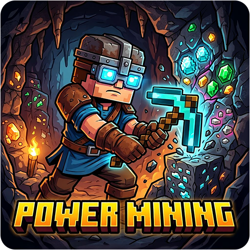



  
  

<h1 align="center">Power Mining Tools</h1>

  <b>Mining enhancements for Minecraft servers.</b> 
  <b>Mounted mining, utility tools, structure tracking, ore scanning, and auto-smelting.</b>

  &nbsp;&nbsp;&nbsp;&nbsp;&nbsp;&nbsp;&nbsp;&nbsp;&nbsp;&nbsp;

Power Mining Tools is an open-source Minecraft plugin that provides a set of mining utility items and mounted mining mechanics. Items are given through `/powermining` subcommands and carry per-item metadata (radius, filter, duration, mode) using persistent data. The plugin includes automated mounted mining, magnetic item collection hoppers, placeable ore scanner bells, wearables for night vision and ore highlighting, return-point teleport ropes, structure-tracking compasses, and an auto-smelting pickaxe.

### **Core Features**

- **Mounted Mining Drill:** While riding an `AbstractHorse` and holding a pickaxe, mines a configurable cuboid ahead of the mount at a configurable interval
- **Magnet Hopper:** Custom hopper item pulls nearby dropped items toward itself on a repeating task
- **Ore Scanner Bell:** Placeable custom bell scans an area for ores and highlights found blocks for a configurable duration with a configurable cooldown
- **Miner's Helmet:** Custom golden helmet grants recurring night vision while worn
- **Escape Rope:** Custom lead sets a return point on block click and teleports back on air right-click, consuming one rope
- **Cave Compass:** Custom compass cycles structure targets and updates lodestone target to located structures
- **Smelter's Pickaxe:** Custom golden pickaxe replaces ore/block drops with smelted outputs and supports fortune-style bonus logic
- **Miner's Goggles:** Custom leather helmet highlights nearby ores with optional filter and radius metadata

### **Supported Platforms**

- **Server Software:** `Spigot`, `Paper`, `Purpur`, `CraftBukkit`
- **Minecraft Versions:** `1.21` and higher
- **Java Requirements:** `Java 17+`

### **Installation**

1. Download the latest `.jar` from the [Releases](https://github.com/Cobbleworks/Power-Mining-Tools/releases) page
2. Stop your Minecraft server
3. Copy the `.jar` into your server's `plugins/` folder
4. Start your server — a default configuration folder is generated at `plugins/PowerMining/`

### **Commands**

**Root command aliases:** `/powermining`, `/pm`

| Command | Description |
|---------|-------------|
| `/pm help` | Show command overview |
| `/pm drill` | Show mounted mining usage info |
| `/pm magnethopper [player] [radius]` | Give a Magnet Hopper (radius must be `1..max-radius`) |
| `/pm orebell [player] [radius] [--filter ORE] [--duration TICKS]` | Give an Ore Scanner Bell with optional ore filter and highlight duration |
| `/pm helmet [player]` | Give a Miner's Helmet |
| `/pm escaperope [player]` | Give an Escape Rope |
| `/pm cavecompass [player]` | Give a Cave Compass |
| `/pm smelterpick [player]` | Give a Smelter's Pickaxe |
| `/pm goggles [player] [radius] [--filter ORE]` | Give Miner's Goggles with optional radius and filter |

**Subcommand aliases from source:**

| Primary | Aliases |
|---------|---------|
| `magnethopper` | `mh` |
| `orebell` | `ob` |
| `helmet` | `minershelmet` |
| `escaperope` | `rope`, `er` |
| `cavecompass` | `compass`, `cc` |
| `smelterpick` | `smelter`, `sp` |
| `goggles` | `minersgoggles`, `mg` |

### **Configuration**

All settings are in `plugins/PowerMining/config.yml`.

| Key | Default | Description |
|-----|---------|-------------|
| `mounted-mining.enabled` | `true` | Enable mounted mining system |
| `mounted-mining.radius-x` | `1` | Mining radius on X-axis |
| `mounted-mining.radius-y` | `1` | Mining radius on Y-axis |
| `mounted-mining.radius-z` | `1` | Mining radius on Z-axis |
| `mounted-mining.mining-interval` | `5` | Mining interval in ticks |
| `mounted-mining.y-offset` | `1` | Y offset for mining center relative to mount |
| `magnet-hopper.enabled` | `true` | Enable magnet hopper system |
| `magnet-hopper.default-radius` | `8` | Default attraction radius for given item |
| `magnet-hopper.max-radius` | `32` | Maximum allowed radius |
| `magnet-hopper.attraction-interval` | `5` | Item attraction tick interval |
| `magnet-hopper.attraction-speed` | `0.5` | Velocity multiplier toward hopper |
| `magnet-hopper.particles.enabled` | `true` | Enable hopper particles |
| `magnet-hopper.particles.type` | `SOUL_FIRE_FLAME` | Particle type for active hoppers |
| `magnet-hopper.particles.count` | `3` | Particle count per emission |
| `magnet-hopper.particles.interval` | `10` | Particle emission interval |
| `ore-scanner-bell.enabled` | `true` | Enable ore scanner bell system |
| `ore-scanner-bell.default-radius` | `16` | Default scanner radius |
| `ore-scanner-bell.max-radius` | `64` | Maximum scanner radius |
| `ore-scanner-bell.default-duration` | `60` | Default highlight duration in ticks |
| `ore-scanner-bell.cooldown` | `30` | Cooldown in seconds per placed bell |
| `ore-scanner-bell.ore-types` | list | Materials considered ores during scan |
| `miners-helmet.enabled` | `true` | Enable miner's helmet functionality |
| `escape-rope.enabled` | `true` | Enable escape rope functionality |
| `cave-compass.enabled` | `true` | Enable cave compass functionality |
| `cave-compass.search-radius` | `5000` | Config value present for structure search radius |
| `auto-smelter-pickaxe.enabled` | `true` | Enable smelter pickaxe functionality |
| `miners-goggles.enabled` | `true` | Enable miner's goggles functionality |
| `miners-goggles.default-radius` | `10` | Default goggles radius |
| `miners-goggles.min-radius` | `5` | Minimum allowed goggles radius |
| `miners-goggles.max-radius` | `20` | Maximum allowed goggles radius |
| `miners-goggles.highlight-interval` | `20` | Configured highlight interval |
| `miners-goggles.highlight-color` | `GOLD` | Configured highlight color |
| `miners-goggles.ore-types` | list | Configured ore type list |
| `messages.*` | strings | MiniMessage-formatted output templates |

### **Permissions**

| Permission | Description | Default |
|------------|-------------|---------|
| `powermining.*` | Full access umbrella | `op` |
| `powermining.use.*` | All use permissions | `true` |
| `powermining.give.*` | All give permissions | `op` |
| `powermining.use.mountedmining` | Use mounted mining | `true` |
| `powermining.use.magnethopper` | Use magnet hoppers | `true` |
| `powermining.use.orescannerbell` | Use ore scanner bells | `true` |
| `powermining.use.minershelmet` | Use miner's helmet | `true` |
| `powermining.use.escaperope` | Use escape rope | `true` |
| `powermining.use.depthmeter` | Use depth meter (permission defined) | `true` |
| `powermining.use.cavecompass` | Use cave compass | `true` |
| `powermining.use.instantladder` | Use instant ladder (permission defined) | `true` |
| `powermining.use.autosmelterpickaxe` | Use smelter pickaxe | `true` |
| `powermining.use.minersgoggles` | Use miner's goggles | `true` |
| `powermining.give.magnethopper` | Give magnet hopper | `op` |
| `powermining.give.orescannerbell` | Give ore scanner bell | `op` |
| `powermining.give.minershelmet` | Give miner's helmet | `op` |
| `powermining.give.escaperope` | Give escape rope | `op` |
| `powermining.give.depthmeter` | Give depth meter (permission defined) | `op` |
| `powermining.give.cavecompass` | Give cave compass | `op` |
| `powermining.give.instantladder` | Give instant ladder (permission defined) | `op` |
| `powermining.give.smelterpickaxe` | Give smelter pickaxe | `op` |
| `powermining.give.minersgoggles` | Give miner's goggles | `op` |

### **Behavior Notes**

- Mounted mining runs only while mounted on an `AbstractHorse`, holding a pickaxe, and having `powermining.use.mountedmining`
- Ore scanner bells are placeable items; placed bell metadata controls radius/filter/duration, and each bell has independent cooldown
- Escape rope stores world and coordinates in item persistent data; teleport consumes one rope item
- Cave compass cycles structures with sneak-click and updates lodestone target on a repeating schedule with cache
- Smelter pickaxe replaces drops only for mapped blocks (iron/gold/copper ores, ancient debris, cobblestone, sand, clay, etc.)

### **License**

This project is licensed under the **MIT License** — see the [LICENSE](LICENSE) file for details.

## **Screenshots**

The screenshots below demonstrate the core features of the Power Mining Tools plugin, including mounted auto-mining with a donkey and pickaxe, and the escape rope for returning to a saved position.

<table>
  <tr>
    <th>Power Mining - Donkey Auto Mining</th>
    <th>Power Mining - Escape Rope</th>
  </tr>
  <tr>
    <td></td>
    <td></td>
  </tr>
</table>
.Value -replace 'width="180"', 'width="180"'  />

<h1 align="center">Power Mining Tools</h1>

  <b>Mining enhancements for Minecraft servers.</b> 
  <b>Mounted mining, utility tools, structure tracking, ore scanning, and auto-smelting.</b>

  &nbsp;&nbsp;&nbsp;&nbsp;&nbsp;&nbsp;&nbsp;&nbsp;&nbsp;&nbsp;

Power Mining Tools is an open-source Minecraft plugin that provides a set of mining utility items and mounted mining mechanics. Items are given through `/powermining` subcommands and carry per-item metadata (radius, filter, duration, mode) using persistent data. The plugin includes automated mounted mining, magnetic item collection hoppers, placeable ore scanner bells, wearables for night vision and ore highlighting, return-point teleport ropes, structure-tracking compasses, and an auto-smelting pickaxe.

### **Core Features**

- **Mounted Mining Drill:** While riding an `AbstractHorse` and holding a pickaxe, mines a configurable cuboid ahead of the mount at a configurable interval
- **Magnet Hopper:** Custom hopper item pulls nearby dropped items toward itself on a repeating task
- **Ore Scanner Bell:** Placeable custom bell scans an area for ores and highlights found blocks for a configurable duration with a configurable cooldown
- **Miner's Helmet:** Custom golden helmet grants recurring night vision while worn
- **Escape Rope:** Custom lead sets a return point on block click and teleports back on air right-click, consuming one rope
- **Cave Compass:** Custom compass cycles structure targets and updates lodestone target to located structures
- **Smelter's Pickaxe:** Custom golden pickaxe replaces ore/block drops with smelted outputs and supports fortune-style bonus logic
- **Miner's Goggles:** Custom leather helmet highlights nearby ores with optional filter and radius metadata

### **Supported Platforms**

- **Server Software:** `Spigot`, `Paper`, `Purpur`, `CraftBukkit`
- **Minecraft Versions:** `1.21` and higher
- **Java Requirements:** `Java 17+`

### **Installation**

1. Download the latest `.jar` from the [Releases](https://github.com/Cobbleworks/Power-Mining-Tools/releases) page
2. Stop your Minecraft server
3. Copy the `.jar` into your server's `plugins/` folder
4. Start your server — a default configuration folder is generated at `plugins/PowerMining/`

### **Commands**

**Root command aliases:** `/powermining`, `/pm`

| Command | Description |
|---------|-------------|
| `/pm help` | Show command overview |
| `/pm drill` | Show mounted mining usage info |
| `/pm magnethopper [player] [radius]` | Give a Magnet Hopper (radius must be `1..max-radius`) |
| `/pm orebell [player] [radius] [--filter ORE] [--duration TICKS]` | Give an Ore Scanner Bell with optional ore filter and highlight duration |
| `/pm helmet [player]` | Give a Miner's Helmet |
| `/pm escaperope [player]` | Give an Escape Rope |
| `/pm cavecompass [player]` | Give a Cave Compass |
| `/pm smelterpick [player]` | Give a Smelter's Pickaxe |
| `/pm goggles [player] [radius] [--filter ORE]` | Give Miner's Goggles with optional radius and filter |

**Subcommand aliases from source:**

| Primary | Aliases |
|---------|---------|
| `magnethopper` | `mh` |
| `orebell` | `ob` |
| `helmet` | `minershelmet` |
| `escaperope` | `rope`, `er` |
| `cavecompass` | `compass`, `cc` |
| `smelterpick` | `smelter`, `sp` |
| `goggles` | `minersgoggles`, `mg` |

### **Configuration**

All settings are in `plugins/PowerMining/config.yml`.

| Key | Default | Description |
|-----|---------|-------------|
| `mounted-mining.enabled` | `true` | Enable mounted mining system |
| `mounted-mining.radius-x` | `1` | Mining radius on X-axis |
| `mounted-mining.radius-y` | `1` | Mining radius on Y-axis |
| `mounted-mining.radius-z` | `1` | Mining radius on Z-axis |
| `mounted-mining.mining-interval` | `5` | Mining interval in ticks |
| `mounted-mining.y-offset` | `1` | Y offset for mining center relative to mount |
| `magnet-hopper.enabled` | `true` | Enable magnet hopper system |
| `magnet-hopper.default-radius` | `8` | Default attraction radius for given item |
| `magnet-hopper.max-radius` | `32` | Maximum allowed radius |
| `magnet-hopper.attraction-interval` | `5` | Item attraction tick interval |
| `magnet-hopper.attraction-speed` | `0.5` | Velocity multiplier toward hopper |
| `magnet-hopper.particles.enabled` | `true` | Enable hopper particles |
| `magnet-hopper.particles.type` | `SOUL_FIRE_FLAME` | Particle type for active hoppers |
| `magnet-hopper.particles.count` | `3` | Particle count per emission |
| `magnet-hopper.particles.interval` | `10` | Particle emission interval |
| `ore-scanner-bell.enabled` | `true` | Enable ore scanner bell system |
| `ore-scanner-bell.default-radius` | `16` | Default scanner radius |
| `ore-scanner-bell.max-radius` | `64` | Maximum scanner radius |
| `ore-scanner-bell.default-duration` | `60` | Default highlight duration in ticks |
| `ore-scanner-bell.cooldown` | `30` | Cooldown in seconds per placed bell |
| `ore-scanner-bell.ore-types` | list | Materials considered ores during scan |
| `miners-helmet.enabled` | `true` | Enable miner's helmet functionality |
| `escape-rope.enabled` | `true` | Enable escape rope functionality |
| `cave-compass.enabled` | `true` | Enable cave compass functionality |
| `cave-compass.search-radius` | `5000` | Config value present for structure search radius |
| `auto-smelter-pickaxe.enabled` | `true` | Enable smelter pickaxe functionality |
| `miners-goggles.enabled` | `true` | Enable miner's goggles functionality |
| `miners-goggles.default-radius` | `10` | Default goggles radius |
| `miners-goggles.min-radius` | `5` | Minimum allowed goggles radius |
| `miners-goggles.max-radius` | `20` | Maximum allowed goggles radius |
| `miners-goggles.highlight-interval` | `20` | Configured highlight interval |
| `miners-goggles.highlight-color` | `GOLD` | Configured highlight color |
| `miners-goggles.ore-types` | list | Configured ore type list |
| `messages.*` | strings | MiniMessage-formatted output templates |

### **Permissions**

| Permission | Description | Default |
|------------|-------------|---------|
| `powermining.*` | Full access umbrella | `op` |
| `powermining.use.*` | All use permissions | `true` |
| `powermining.give.*` | All give permissions | `op` |
| `powermining.use.mountedmining` | Use mounted mining | `true` |
| `powermining.use.magnethopper` | Use magnet hoppers | `true` |
| `powermining.use.orescannerbell` | Use ore scanner bells | `true` |
| `powermining.use.minershelmet` | Use miner's helmet | `true` |
| `powermining.use.escaperope` | Use escape rope | `true` |
| `powermining.use.depthmeter` | Use depth meter (permission defined) | `true` |
| `powermining.use.cavecompass` | Use cave compass | `true` |
| `powermining.use.instantladder` | Use instant ladder (permission defined) | `true` |
| `powermining.use.autosmelterpickaxe` | Use smelter pickaxe | `true` |
| `powermining.use.minersgoggles` | Use miner's goggles | `true` |
| `powermining.give.magnethopper` | Give magnet hopper | `op` |
| `powermining.give.orescannerbell` | Give ore scanner bell | `op` |
| `powermining.give.minershelmet` | Give miner's helmet | `op` |
| `powermining.give.escaperope` | Give escape rope | `op` |
| `powermining.give.depthmeter` | Give depth meter (permission defined) | `op` |
| `powermining.give.cavecompass` | Give cave compass | `op` |
| `powermining.give.instantladder` | Give instant ladder (permission defined) | `op` |
| `powermining.give.smelterpickaxe` | Give smelter pickaxe | `op` |
| `powermining.give.minersgoggles` | Give miner's goggles | `op` |

### **Behavior Notes**

- Mounted mining runs only while mounted on an `AbstractHorse`, holding a pickaxe, and having `powermining.use.mountedmining`
- Ore scanner bells are placeable items; placed bell metadata controls radius/filter/duration, and each bell has independent cooldown
- Escape rope stores world and coordinates in item persistent data; teleport consumes one rope item
- Cave compass cycles structures with sneak-click and updates lodestone target on a repeating schedule with cache
- Smelter pickaxe replaces drops only for mapped blocks (iron/gold/copper ores, ancient debris, cobblestone, sand, clay, etc.)

### **License**

This project is licensed under the **MIT License** — see the [LICENSE](LICENSE) file for details.

## **Screenshots**

The screenshots below demonstrate the core features of the Power Mining Tools plugin, including mounted auto-mining with a donkey and pickaxe, and the escape rope for returning to a saved position.

<table>
  <tr>
    <th>Power Mining - Donkey Auto Mining</th>
    <th>Power Mining - Escape Rope</th>
  </tr>
  <tr>
    <td></td>
    <td></td>
  </tr>
</table>
